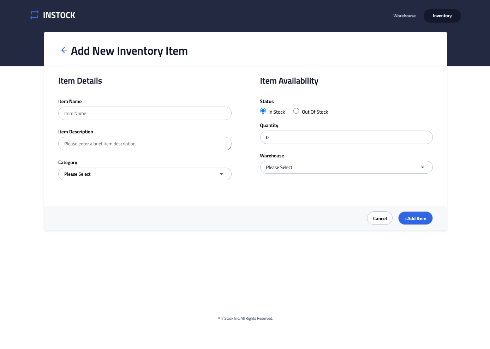
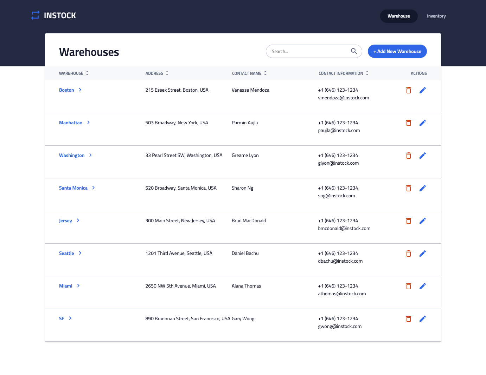
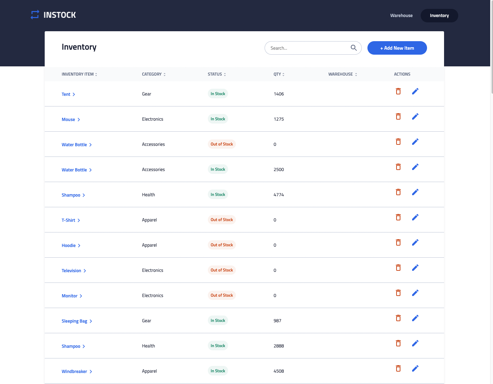
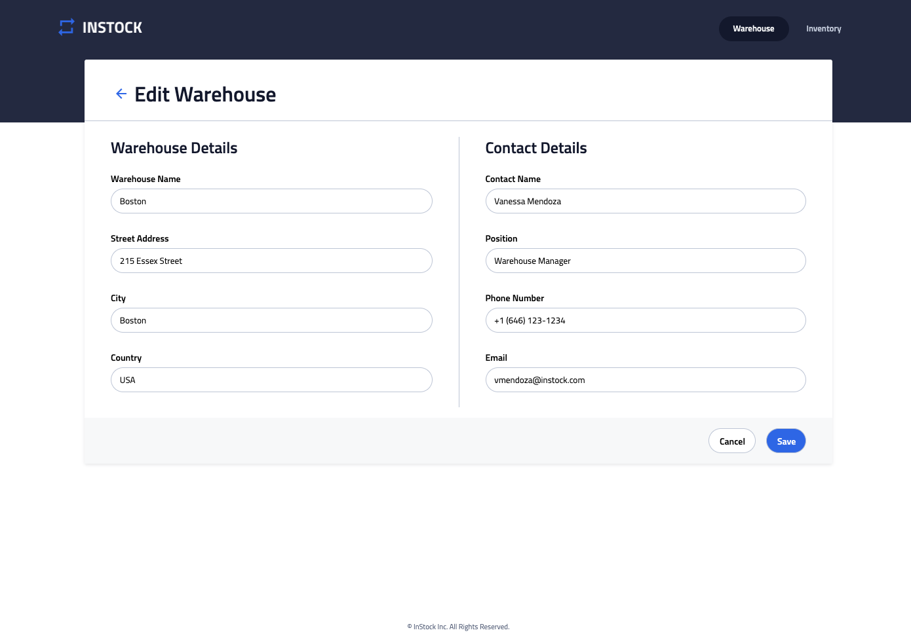
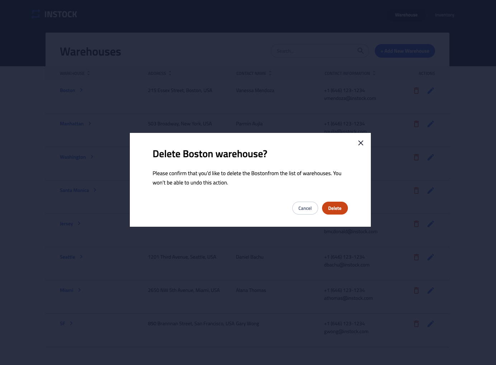

# Instock Inventory Management Web App

This was a group project at BrainStation. Our Team called Fernie was a group of 4 devs - Cindy, Daisy, Muskan, and Claire. During our one week deadline, we divided tasks using JIRA agile development workflow. Morning stands-up and meetings were done on Slack on a daily basis.

We learned how important it was to develop and improve our communication skills to increase efficiency. Also, we often faced merge conflicts while using group repo, which was a good lesson for us. After experiencing those merge issues, we became more aware and cautious on the tasks that followed to avoid pitballs. Our checklist before merging or pushing included one question, "Which branch and order am I currently working on?" and always kept in mind, "Always pay attention and communicate with the team!".

[Demo link](https://www.youtube.com/watch?v=mkDwSbr5Rcg)

[Frontend](https://github.com/jclairelee/inStock) | [Backend](https://github.com/jclairelee/inStock-server)







## Tech Stack

### Frontend:

- React
- SASS
- DOM manipulation

### Backend:

- Node.js
- Express.js
- Knex.js
- mySQL database

## Installation

### backend Setup

1. Install server dependencies:

   Run `npm install` from inside the directory:

   ```bash
   $ npm install
   ```

2. Create a new MySQL Database called 'instock'.

3. Set environment variables:

   Create a `.env` file as:

   ```shell
   DB_LOCAL_DBNAME = <your_db_username>
   DB_LOCAL_USER = <your_db_password>
   DB_LOCAL_PASSWORD = <your_db_password>
   ```

4. Seed your data

   ```bash
   $ npm run migrate
   ```

5. Run seeds
   ```bash
   $ npm run seed
   ```
6. Start the server:
   ```bash
   $ npm start
   ```

### frontend Setup

7. Install client dependencies:

   Run `npm install` from inside the directory.

   ```bash
      $ npm install
   ```

8. Start the React app:
   ```bash
   $ npm start
   ```
